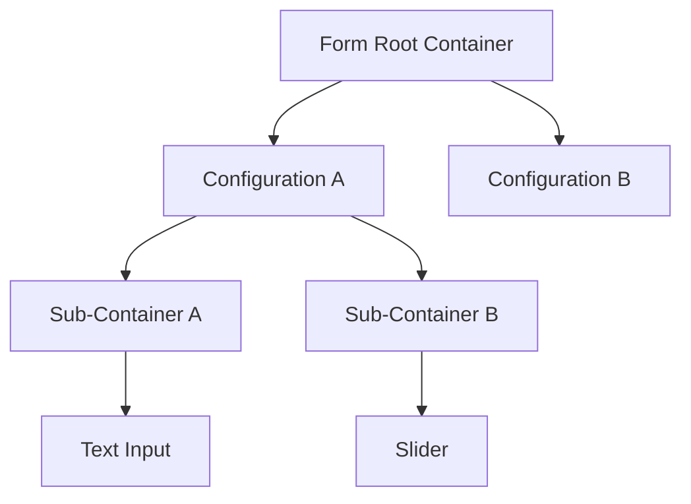
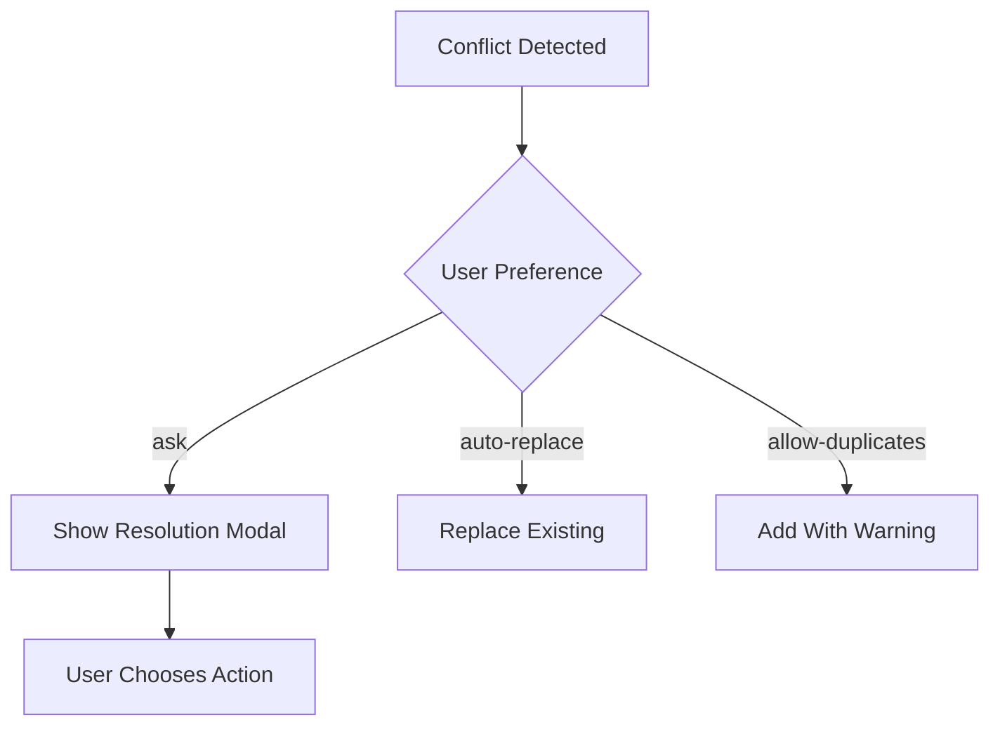

# Linking, Hierarchy, and Conflict Resolution

This specification describes how Calculogic synchronizes structure and behavior across tabs, manages container inheritance, and resolves conflicts produced by automated or manual edits.

## 1. Manifestation Linking (auto-generated rules)
When properties are enabled in one concern, Calculogic auto-manifests linked rules in the appropriate partner concern while keeping references bi-directional.

| Source tab | Auto-manifests as | Example |
| --- | --- | --- |
| Build | Logic (Workflow) rule | `required: true` → creates a required-validation rule |
| Knowledge | Logic (Workflow) validator | `trait.email.format = "email"` → e-mail format validator |
| Logic (Workflow) | Build property update | Deleting a rule removes its related `required` property |

### Flow diagram
```mermaid
graph LR
  A[Build Tab] -- required=true --> B[Auto-Create Required Rule]
  B --> C[Logic (Workflow) Tab]
  D[Logic (Workflow) Tab] -- Delete Rule --> E[Build Tab required=false]
```

Auto-manifested rules are always visible in the Logic (Workflow) tab and tagged as “auto-linked.” Manual rules take precedence but do not delete auto-linked entries unless the user explicitly removes them.

**Principle:** Each manifestation link represents a bi-directional reflection. Build defines potential, Logic (Workflow) defines behavior, and both stay synchronized through the engine's internal manifest registry.

## 2. Link management rules
| Case | System behavior | User experience |
| --- | --- | --- |
| Auto-creation | Enabling a property in Build or Knowledge silently generates the linked rule or reference in the target tab. | Linked elements display a 🔗 icon and metadata noting their origin. |
| Manual creation | User adds logic, style, or result entries manually. | Appears with a ⛓️ icon and “Unlinked” indicator until explicitly connected. |
| Duplicate attempt | Adding a second instance of the same linkage triggers a modal. | ⚠ “Component already has [rule]” with options **Replace existing**, **Add as exception**, or **Cancel**. |
| Deletion | Removing a linked rule or style disables its source property. | Source checkbox toggles off automatically, preventing stale links. |

**Conflict priority:**
- Build is authoritative for structure.
- Logic (Workflow) and Results/Style tabs may override behavior or visuals only after explicit confirmation.
- If Build data is absent (logic-only exports or external integrations), Logic (Workflow) becomes the structural authority to preserve export integrity.

This maintains bidirectional integrity while preserving the “Silent Automation + Manual Escape Hatch” principle.

## 3. Container inheritance hierarchy
All structure within a Configuration follows a predictable hierarchy that mirrors export order and logical containment.



### Behavioral rules
- **Automatic wrapping:** A lone atomic dropped on the root canvas auto-wraps in a generated sub-container (`"autoWrapped": true` in Build JSON).
- **Rule inheritance:** Container-level rules apply to children; component-level definitions override inherited rules.
- The UI visually marks inherited rules.

### JSON representation
```json
{
  "id": "container_personalInfo",
  "inheritRules": true,
  "children": [
    { "id": "nameInput", "overrides": ["required"] }
  ]
}
```

## 4. Conflict resolution system
Every Project stores preferences controlling how rule or link conflicts are handled.

```json
{
  "ruleConflictResolution": "ask",      // ask | auto-replace | allow-duplicates
  "containerAutoWrap": true,
  "defaultRuleScope": "component"      // component | sub-container | configuration
}
```

### Exception handling flow


**Modal example:**
```
⚠ Duplicate Validation Rule
----------------------------------
Field "UserEmail" already has:
• Required Rule (added automatically)

[Replace Existing] [Add Anyway] [Cancel]
[ ] Remember this choice for all validations
```

## 5. Dual-canvas styling (results-aware view system)
Calculogic maintains separate canvases for input and output phases. Both follow the same structural scope but apply different style layers.

| Canvas | Purpose | Example rule |
| --- | --- | --- |
| Build Canvas | Active form/quiz during input | `[data-scope="build"] .text-input { width: 100% }` |
| Results Canvas | Post-submission / analysis display | `[data-scope="results"] .text-input { width: 80% }` |

**View rule declaration example:**
```json
{
  "type": "width",
  "target": "text-email",
  "value": "100%",
  "scope": "build"  // or "results"
}
```

## 6. Documentation integration points
To keep the living documentation synchronized, update the following sections:

| Section | Addition |
| --- | --- |
| §3.4 – Why This Works Without Raw Code | Add “Auto-Manifested Properties Across Tabs” explaining Build ↔ Logic (Workflow) reflection. |
| §5 – Example: Enneagram Test | Note that required fields auto-generate validation rules via manifestation linking. |
| §8 – Developer Documentation | Extend “Configuration Behavior” to describe rule inheritance hierarchy and override logic. |
| §11 – UI/UX Principles | Add the principle “Silent Automation with Manual Escape Hatches,” covering automation, overrides, and visual indicators. |

## 7. Visual design and indicators
| Status | Icon | Description |
| --- | --- | --- |
| Auto-linked | 🔗 | Generated automatically from another concern. |
| Manually linked | ⛓️ | Added by a user and explicitly connected. |
| Conflict | ⚠️ | Requires user decision; opens the resolution modal. |
| Inherited rule | ♻️ | Displays that behavior originates from a parent container. |
